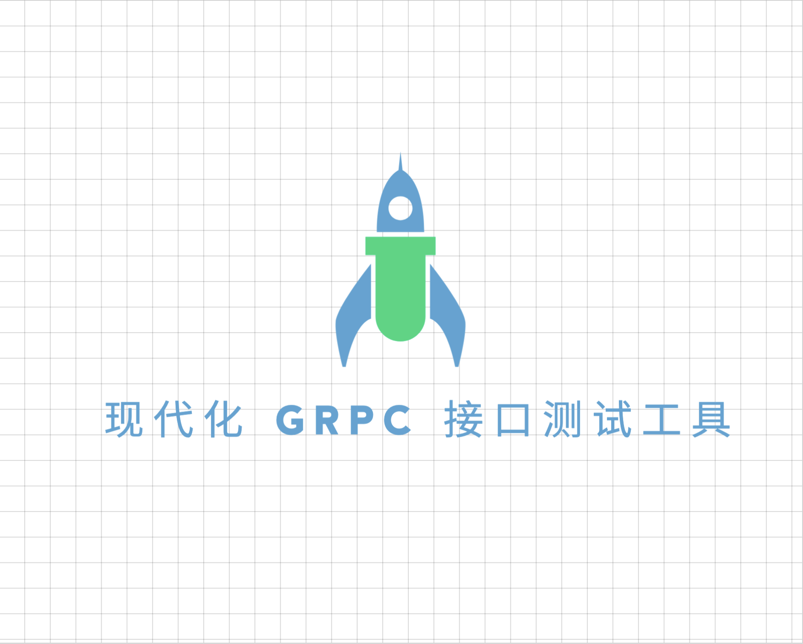

<div align="center">
<h1>RPC Postman</h1>

[](https://github.com/vtyug/rpc-postman)
[](https://github.com/vtyug)
[](https://vuejs.org/)
[](https://www.electronjs.org/)
[](https://element-plus.org/)
[](https://www.typescriptlang.org/)
[](https://github.com/vtyug/rpc-postman/issues)
[](https://github.com/vtyug/rpc-postman/stargazers)
[](./LICENSE)

<p>🚀 一个现代化的 gRPC 接口测试工具 | A Modern gRPC API Testing Tool 🚀</p>

<br><br>

<p align="center">
  
</p>

</div>

## 简介

一个基于 Electron + Vue 3 的 gRPC 接口测试工具，类似于 Postman，但专注于 gRPC 接口测试。

## 功能特点

### 已实现功能

#### gRPC 服务探索

- ✅ 自动发现和列出服务器上的所有 gRPC 服务
- ✅ 显示每个服务的所有可用方法
- ✅ 支持服务和方法的搜索过滤
- ✅ 自动解析 Proto 文件定义

#### 请求构建

- ✅ Monaco Editor 代码编辑器，支持语法高亮
- ✅ 自动生成示例请求消息
- ✅ 多种授权方式支持：
  - No Auth
  - API Key
  - Bearer Token
  - Basic Auth
- ✅ 自定义 Metadata 设置
- ✅ 请求参数格式化
- ✅ 示例图片展示

#### 响应处理

- ✅ JSON 格式化展示响应数据
- ✅ 显示请求响应时间
- ✅ 响应数据语法高亮
- ✅ 响应数据格式化

#### 工作区管理

- ✅ 多标签页支持
- ✅ 新建/关闭标签页
- ✅ 独立工作区

### 正在开发

#### 环境变量管理

- 🚧 多环境配置
- 🚧 变量替换功能
- 🚧 环境快速切换

#### 历史记录

- 🚧 请求历史记录
- 🚧 快速重放历史请求
- 🚧 历史记录搜索和筛选

#### 收藏夹

- 🚧 保存常用请求
- 🚧 收藏夹分组管理
- 🚧 快速加载收藏的请求

### 计划开发

#### 代码生成

- 📝 生成多语言的客户端代码
- 📝 支持 Go、Java、Python 等主流语言
- 📝 代码片段复制功能

#### 请求脚本

- 📝 支持请求前后的脚本执行
- 📝 变量提取和重用
- 📝 环境变量动态设置

#### 测试集合

- 📝 创建测试集合
- 📝 批量运行测试
- 📝 测试报告生成

#### Mock 服务

- 📝 基于 proto 文件生成 Mock 服务
- 📝 自定义 Mock 响应
- 📝 Mock 服务管理

#### 性能测试

- 📝 并发请求测试
- 📝 性能指标统计
- 📝 测试报告导出

#### 团队协作

- 📝 请求配置导入导出
- 📝 团队共享收藏夹
- 📝 配置同步功能

## 技术栈

- ⚡️ Electron - 跨平台桌面应用框架
- 🔥 Vue 3 - 渐进式 JavaScript 框架
- 🦾 TypeScript - 带有类型系统的 JavaScript
- 🎨 Element Plus - Vue 3 组件库
- 📝 Monaco Editor - VS Code 同款编辑器
- 🚀 gRPC - 高性能 RPC 框架

## 开发环境

### 系统要求

- Node.js 16+
- pnpm 8+

### 安装依赖

### 本地开发

1. 克隆仓库

   ```bash
   git clone https://github.com/your-repo/your-project.git
   cd your-project
   ```

2. 安装依赖

   ```bash
   pnpm install
   ```

3. 启动开发环境

   ```bash
   pnpm run dev
   ```

4. 打包应用

   ```bash
   pnpm run build
   ```

5. 运行测试
   ```bash
   pnpm run test
   ```

## 贡献指南

1. Fork 本仓库
2. 创建你的特性分支 (`git checkout -b feature/AmazingFeature`)
3. 提交你的改动 (`git commit -m 'Add some AmazingFeature'`)
4. 推送到分支 (`git push origin feature/AmazingFeature`)
5. 打开一个 Pull Request

## 许可证

[MIT License](LICENSE)
